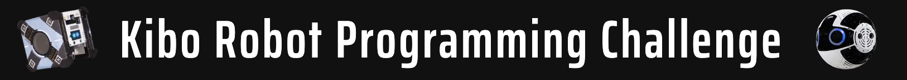
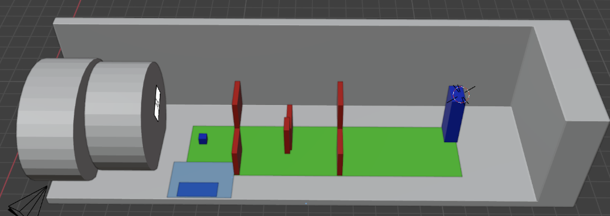
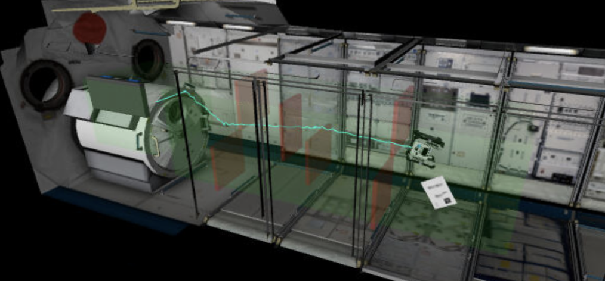

# [5th Kibo Robot Programming Challenge](https://jaxa.krpc.jp/) - Team Salcedo

## Code Description

The following table describes the project structure of `./app/src/main/java/jp/jaxa/iss/kibo/rpc/usa`.

| File                | Description                                                                                            |
| ------------------- | ------------------------------------------------------------------------------------------------------ |
| `MainActivity.java` | Main file the APK runs                                                                                 |
| `YourService.java`  | Selects planned run                                                                                    |
| `Movement.java`     | Responsible for executing planned movement and orientation of the Astrobee                             |
| `Vector.java`       | Helper file that executes vector operations and point calculations on the movement side of the program |
| `Recognition.java`  | Responsible for using OpenCV Deep Neural Network to recognize objects and Aruco codes                  |
| `Vision.java`       | Responsible for using the Kibo API to facilitate usage of Astrobee's sensors and cameras               |

## Path Planning

We used quaternions to orient the Astrobee to have a proper view on the targets. The movement was designed to both navigate through the challenge course and achieve an optimal distance from the targets for object recognition.

To facilitate minor changes in movement while testing we prepared a generation of the challenge course in Blender:  

 
which reflects the following Astrobee path:  

## Computer Vision

We used Roboflow to annotate images for recognition, create a train/test dataset, and train our YOLOv9c model. [Our YOLOv9c model on Ultralytics](https://hub.ultralytics.com/models/NeSlB0EYCf2a9GrVRkf4).

## Meet The Team

- Aaron Kantsevoy (Team-Lead)
- Justin Bonner (Strategist/Computer Vision Engineer)
- Lucas Paschke (Computer Vision/Movement Engineer)
- Gabriel Ashkenazi (Computer Vision Engineer/DevOps)
